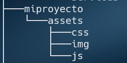

# Mi primer script
### Instrucciones:
Se le pide que realice un script que ejecute lo siguiente.

1. Al ejecutar debe pedir un nombre de proyecto y un mensaje.
2. Crear el siguiente arbol de directorios.



3. La carpeta raiz debe llevar del proyecto que se le ingresa.

4. En la carpeta assets/css crear un archivo style.css con los estilos:
```css
    body{
        background-color: #2b388f;
        display: grid;
        place-items: center;
    }
    h2{
        color: #fff
    }
```

5. en la carpeta raiz crear un archivo index.html con el siguiente codigo.
```html
<!DOCTYPE html>
<html lang="en">
<head>
    <meta charset="UTF-8">
    <meta http-equiv="X-UA-Compatible" content="IE=edge">
    <meta name="viewport" content="width=device-width, initial-scale=1.0">
    <title>Scripting</title>
    <link rel="stylesheet" href="assets/css/style.css">
</head>
<body>
    <h2>{mensaje}</h2>
</body>
</html>
```
La etiqueta <h2></h2> debe contener el mensaje que se haya ingresado. 

6. Para finalizar, debera ejecutarse el sitio web en el navegador y mostrar el mensaje. 

* puntos extras. 
- si genera  un repositorio de git. 
