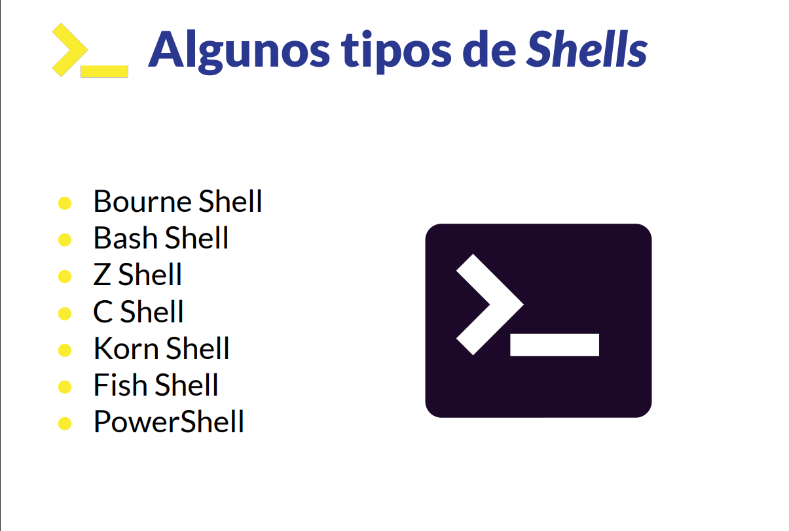
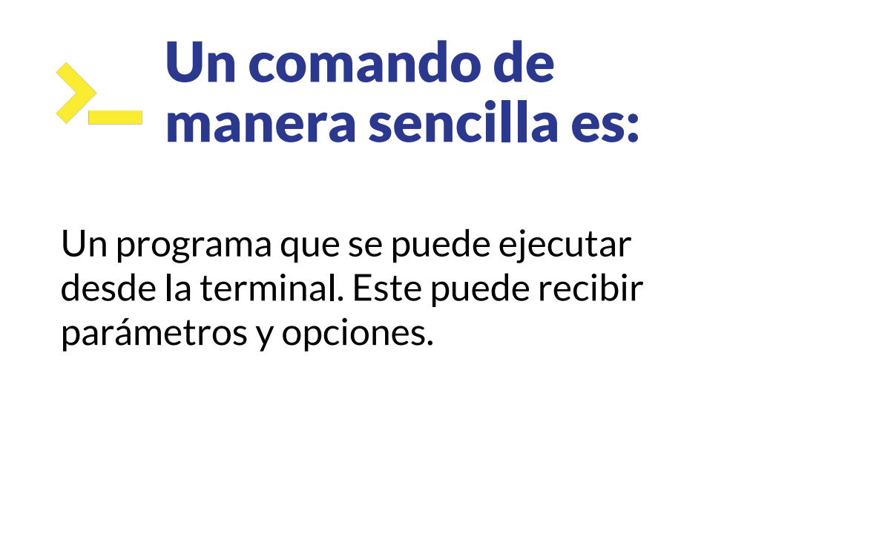

### Introduccion a la terminal y linea de comandos

---

---

---

---

---

---
# Aprendiendo a caminar en la terminal

---

---

### - Manipuladon archivos y directorios.

### - Explorando el contenido de nuestro archivos.

---
# Qué es un comando ?
---

---
# Redirecciones en la shell

---

---

# Redirecciones PIPE

---
# Encadenando Comandos operadores de control
---

# Manejo de permisos

---

---

---

---

# Comando de busqueda

---

# Utilidades de red

---

# Comprimiendo Archivos

---
# Manejo de Procesos

---

# Editores de texto en la terminal

---

# Script basico 

